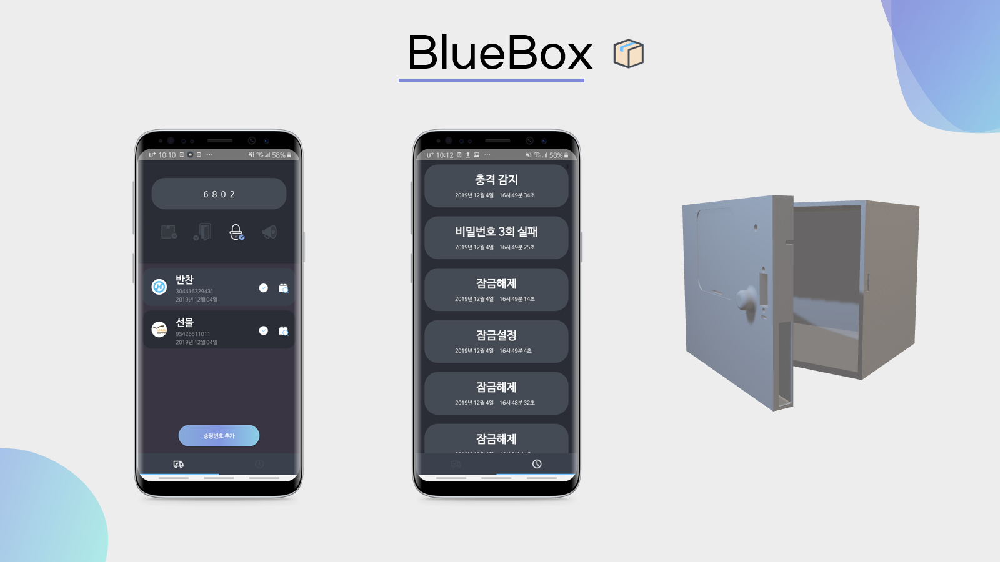
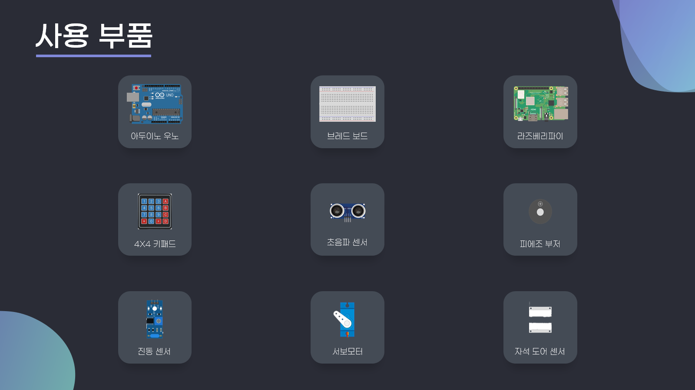

 
# BlueBox
1. 개발동기와 주제
 * 2019년 6월 JTBC 뉴스에서 어느 한 지역의 택배기사분들이 신축 아파트에 존재하는 무인 택배함의 비밀번호를 쉬운 번호로 해놔서 주민들이 택배를 잃어버리는 사고가 발생했다는 기사를 보게되었다. 
 택배 기사들은 물량이 많아 일일이 하나씩 비밀번호를 입력해주는게 너무 오래 걸린다는 답변을 했다. 
 실제로 인터뷰 내용에는 다른 주민분이 택배함을 열어서 가져다 줬다는 내용도 있었다. 
 클릭 하나만으로 잠금과 동시에 비밀번호가 랜덤으로 부여되는 서비스를 만들어보자고 생각했다.

1. 소프트웨어 환경
    * 어플리케이션 개발
      * 언어 : 코틀린
      * 개발도구 : 안드로이드 스튜디오
      * 서버 및 DB : 파이어베이스
    * 임베디드 구동 코드 개발
      * 언어 : C언어
      * 개발도구 : 아두이노 IDE
    * 어플리케이션 임베디드 연동
      * OS : 우분투
      * 언어 : 파이썬3
      * 개발도구 : 파이참, VIM
2. 임베디드 환경
  * 사용 부품
    *  
  * 틀 제작(3D 모델링 후 프린팅)
    *  
3. 기능
    * 어플리케이션 기능
      * 택배함 상태 표현
      * 송장번호 추가 후 배송상태 조회
      * 잠금 설정/해제와 비밀번호 실패, 경보작동 기록 출력
    * 임베디드 작품[택배함]
      * 비밀번호 입력 및 잠금
      * 충격 시 경보음 작동
      * 비밀번호 3회 실패시 경보음 작동
4. 시연 영상
   1. <a href="https://www.youtube.com/watch?v=5LMG8g9TP5U">어플리케이션 시연</a>